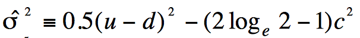
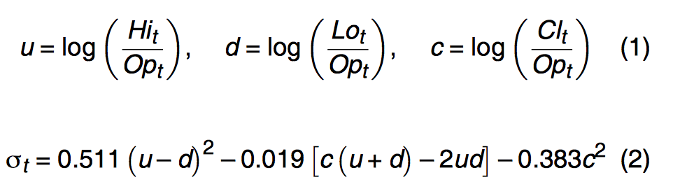

# Plan
## Step 1 - get raw data
1. ~~Get domestic trends~~ - **DONE**
3. ~~Download company data~~ - **DONE**
  4. ~~Choose companies~~ - **DONE**
  5. ~~Download~~ - **DONE**
  6. ~~Mark sector~~ - **DONE**
  7. ~~Save~~ - **DONE**
4. Calculate volatility, log returns, possibly other vars
    5. returns:
        `df.Close.diff().apply(np.log)`
    5. volatility simple
        
    6. volatility complex
        
    7. [[source for equations]][0cdb0039]
    8. [[Deep Learning Stock Volatility with Google Domestic Trends]][59d0c0aa]
    9. sector (one hot encoding)
5. Save a proper data file

## Step 2 - prep LSTM
1. Choose setup
  2. Keras+Theano?
  3. Tensorflow?
  4. Mxnet?
2. Install docker
3. Configure LSTM and run basic training
4. Validate, tune
5. Validate

## Step 3 - more complex LSTM
1. Stack 2 LSTMs ?
2. Use the ResNet approach ?
3. Train, Validate
4. Validate
5. Compare

## Step 3 - Analyze results
1. Calculate error measures
2. Visualize results
  3. Visualize:
    4. Predictions,
    5. Errors,
    6. LSTM inner state?
    *inspiration from Karpathy- Are there special neurons that get triggered by particular patterns?*
3. Test on companies that we didn't learn on
3. Create a service that works with today's data.

[59d0c0aa]: https://arxiv.org/pdf/1512.04916v3.pdf "Deep Learning Stock Volatility with Google Domestic Trends"
[0cdb0039]: https://www.cmegroup.com/trading/fx/files/a_estimation_of_security_price.pdf "Equations come from this publication"
